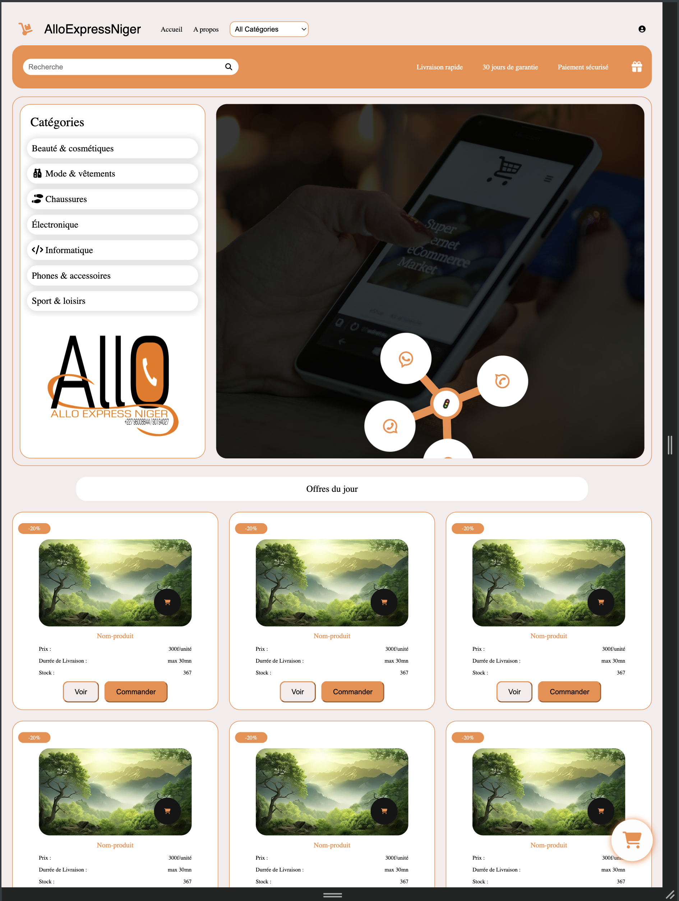

# 📦 AlloExpressNiger — Projet Frontend (HTML & CSS uniquement)

## 📝 Description

**AlloExpressNiger** est une interface de site e-commerce conçue uniquement avec **HTML5** et **CSS3**, sans utilisation de JavaScript ni de framework externe. Ce projet met en avant une page d'accueil moderne et responsive destinée à la présentation de produits et catégories pour une plateforme de vente en ligne locale.

L'objectif principal est de pratiquer et démontrer les bases solides du développement web front-end en utilisant uniquement les technologies fondamentales.

---

## 🎯 Objectifs du projet

* Apprendre à structurer une page web avec HTML sémantique
* Maîtriser la mise en page avec CSS (Flexbox et Grid)
* Créer un design professionnel sans JavaScript
* Comprendre la structure d'un site e-commerce
* Mettre en pratique la gestion des composants visuels (header, sidebar, cartes produits)

---

## 🛠️ Technologies utilisées

* ✅ HTML5
* ✅ CSS3
* ❌ Aucun framework CSS
* ❌ Aucun JavaScript
* ❌ Aucune bibliothèque externe

---

## 📂 Structure du projet

```
AlloExpressNiger/
│
├── index.html
├── style.css
├── assets
|   |––fontawesome
|   |––img
├── paages/
│   ├── 
│   ├── 
│   └── 
└── README.md
```

---

## 🖥️ Aperçu des fonctionnalités

### ✔️ Interface utilisateur

* Barre de navigation avec logo et menu
* Barre de recherche personnalisée
* Section catégories avec icônes
* Slider visuel (image héro)
* Section "Offres du jour"
* Section "Suggestions"
* Section "Produits"
* Section "Temoignages"
* Cartes produits avec badge de réduction
* Bouton panier flottant

### ✔️ Design

* Couleurs dominantes : orange & blanc
* Cartes arrondies avec ombrage
* Mise en page responsive
* Effets hover CSS
* Grille fluide pour affichage des produits

---
## 📸 Capture d'écran

> Interface principale de la page d'accueil avec les catégories à gauche et le slider central.



---

## 🧠 Compétences développées

* Structuration HTML propre et lisible
* Utilisation avancée de Flexbox
* Gestion des espacements et alignements
* Création d'une interface responsive
* Organisation d'un projet web statique

---

## ✍️ Auteur

Projet réalisé par **Omar Epiphane**

---

## 📌 Remarques

Ce projet est destiné à un usage pédagogique pour les débutants souhaitant comprendre les bases du développement web sans dépendre de JavaScript ou de frameworks.

Des améliorations futures pourraient inclure :

* Intégration JavaScript
* Fonctionnalité panier dynamique
* Backend avec base de données

---

## 📄 Licence

Ce projet est libre d'utilisation à des fins éducatives.

---

> 💡 *"Apprendre à maîtriser le HTML et le CSS est la première étape pour devenir un bon développeur web."*
